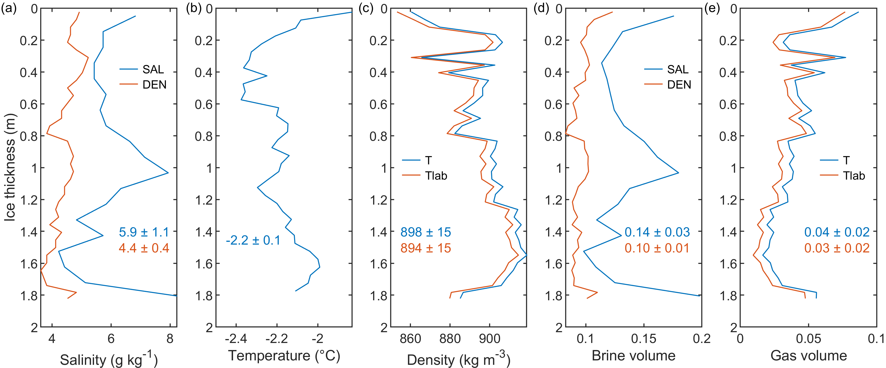

# Platelet Ice Density & Salinity Processing Tools

MATLAB scripts and example data used to generate sea‑ice density, brine volume, and air‑volume estimates for Antarctic platelet‑ice cores collected in the King Haakon VII Sea.

---

## Associated Publication

Lenss et al. (2025)  
"Incorporated platelet ice layers provide refuge for sea‑ice algae in the Kong Håkon VII Hav"  
Marine Ecology Progress Series  
DOI: https://doi.org/10.3354/meps14979

---

## Zenodo Archive

https://doi.org/10.5281/zenodo.17293310

This repository corresponds to the archived version at Zenodo:

Salganik, E.; Itkin, P.; Lenss, M. (2025)  
"Density and salinity of Antarctic sea ice at King Haakon VII Sea"  
Zenodo. https://doi.org/10.5281/zenodo.17293310

---

## Dataset Description

Sea‑ice density and salinity were measured at the Norwegian Polar Institute cold laboratory at −15 °C.  
The ice core was collected on 14 January 2020 at 11.46°E, 69.66°S in the King Haakon VII Sea.  
These measurements form the supplementary dataset for Lenss et al. (2025).

---

## Repository Contents

• `lenss.m` — Main MATLAB script computing sea‑ice density, brine volume fraction, and air volume fraction  
• `lenss_st6.mat` — Raw dataset  
• `gsw_SA_from_SP.m` — TEOS‑10 routine for converting practical to absolute salinity  
• `quicklook.png` — Overview figure of workflow and outputs

---

## Dependencies

This workflow uses the TEOS‑10 Gibbs SeaWater toolbox:

gsw_SA_from_SP  
https://teos-10.org/pubs/gsw/html/gsw_SA_from_SP.html

Ensure the TEOS‑10 toolbox is added to your MATLAB path.

---

## Quicklook

---

## How to Use

1. Clone this repository.  
2. Add the TEOS‑10 toolbox to your MATLAB path.  
3. Open `lenss.m`.  
4. Adjust input file names or paths if needed.  
5. Run the script to generate density, brine, and air‑volume estimates.

Outputs include:  
• Sea‑ice density profile  
• Brine volume fraction  
• Air volume fraction  
• Optional diagnostic plots

---

## Authors

Evgenii Salganik — https://orcid.org/0000-0001-8383-7815  
Polona Itkin — https://orcid.org/0000-0002-4029-1936  
Megan Lenss — https://orcid.org/0009-0007-5250-1826

---

## Citation

If you use this code or dataset, please cite both:

1. Lenss et al. (2025), Marine Ecology Progress Series  
   https://doi.org/10.3354/meps14979

2. Salganik, Itkin & Lenss (2025), Zenodo archive  
   https://doi.org/10.5281/zenodo.17293310
